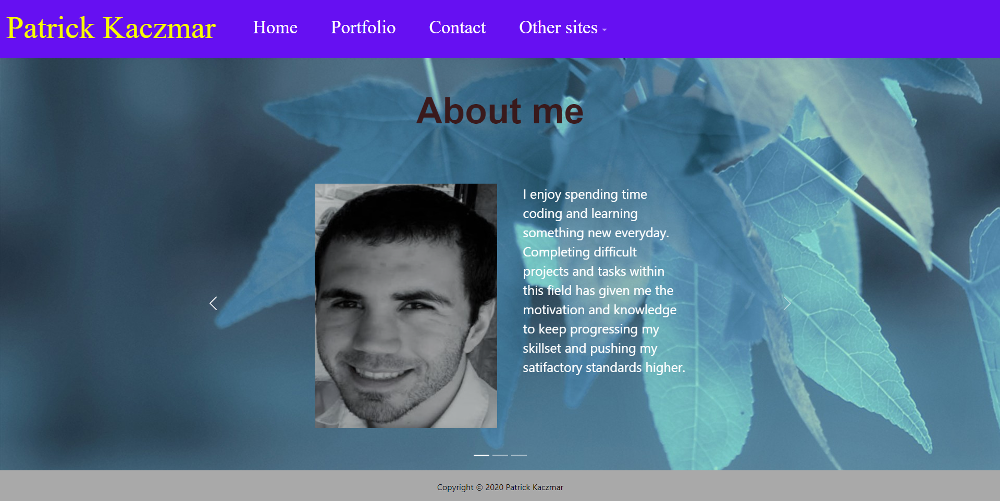

# Patrick-Kaczmar.github.io

This is my portfolio made to showcase all of the software, projects and code I have created. I was inspired to make this portfolio as a way to document and show my progress as a developer aswell as keeping track of what skills I have learned and need to improve on.

This was made using HTML and CSS along with Bootstrap's open-source CSS and javascript framework for some components.

## Bootstrap's Navbar framework - https://getbootstrap.com/docs/5.0/components/navbar/

## Bootstrap's Carousel framework - https://getbootstrap.com/docs/5.0/components/carousel/

## link to active portfolio website - https://patrick-kaczmar.github.io/

### Usage: Click on the options in the navigation bar at the top of the page to jump to different pages.

## License 

This application has no license 
